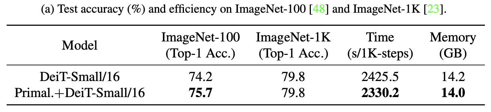

# Primal-Attention for Vision Recognization

We compare our method with the canonical [[DeiT]](https://github.com/facebookresearch/deit/blob/main/README_deit.md) on [[ImageNet-1K]](https://www.image-net.org/) and [[ImageNet-100]](https://github.com/danielchyeh/ImageNet-100-Pytorch) dataset.

We base our code on the official code of [[DeiT]](https://github.com/facebookresearch/deit/blob/main/README_deit.md).

<p align="center">

</p>

## 1. Installation
Please install PyTorch 1.7.1 and torchvision 0.8.2 and timm:
``` Bash
conda create -n primal-cv
conda activate primal-cv
conda install pytorch==1.7.1 torchvision==0.8.2 torchaudio==0.7.2 cudatoolkit=11.0 -c pytorch
pip install timm==0.4.12
``` 

## Data Preparation

For download and preprocess ImageNet-100 dataset, please refer to [[ImageNet-100]](https://github.com/danielchyeh/ImageNet-100-Pytorch).

The training and validation data is expected to be in the `train/` folder and `val/` folder respectively:

```
/path/to/data/
├── imagenet/
│      ├── train/
│      ├── val/
├── imagenet-100/ (would be generated, no need to specify)
│      ├── train/
│      ├── val/
```

## Run tasks
To train Primal.+DeiT-Small/16 with only one Primal-Attention layer, and DeiT-Small/16 on a single node with 2 A100 GPUs for batchsize 1024 and 300 epochs run:
```shell
# Primal.+DeiT-Small/16 on ImageNet-100
bash ./bashes/run_combo_small_rank96_layer1.sh
```
and 
```shell
# DeiT-Small/16 on ImageNet-100
bash ./bashes/run_deit_small.sh
```

Please use the following commands for the training in ImageNet-1K
```shell
# Primal.+DeiT-Small/16 on ImageNet-1K
# Please change "--data-path" and "--out-dir" to your own paths
# 2 A100. each batch_size = 512
python -m torch.distributed.launch --nproc_per_node=2 --use_env main_combo.py --model primal_small_patch16_224 --batch-size 512 --data-path ./imagenet --data-set IMNET --low-rank 96 --rank-multi 10 --num-ksvd-layer 1 --eta 0.05 --output_dir ./combo_small_rank96_multi10_eta005_numlayer1_imagenet1k_results
```
and 
```shell
# DeiT-Small/16 on ImageNet-1K
# Please change "--data-path" and "--out-dir" to your own paths
# 2 A100. each batch_size = 512
python -m torch.distributed.launch --nproc_per_node=2 --use_env main.py --model deit_small_patch16_224 --batch-size 512 --data-path ./imagenet --data-set IMNET --output_dir ./deit_small_imagenet1k_results
```

## Acknowledgement

We appreciate the following github repositories for their valuable codes:

https://github.com/facebookresearch/deit/blob/main/README_deit.md

https://github.com/danielchyeh/ImageNet-100-Pytorch
