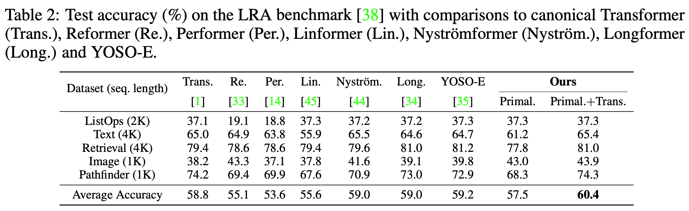

# PrimalFormer for Long Sequence Modeling

In PrimalFormer, Primal-Attention is applied to all attention layers, regularized with the KSVD loss. 

We test our PrimalFormer on the [[LRA benchmark]](https://github.com/google-research/long-range-arena), which is a benchmark for the long-sequence scenarios.

We base our code on the official code of [[Nystromformer]](https://github.com/mlpen/Nystromformer/tree/main/LRA).

<p align="center">

</p>

<p align="center">

</p>

## Data Preparation

For LRA processed dataset, please download from [[LRA_preprocessed](https://drive.google.com/drive/folders/1rE0SjpeFKPFtgmWWjYCoIMz91UozHWWC)].

If you would like to preprocess the dataset yourself, please refer to the official code of [[Nystromformer]](https://github.com/mlpen/Nystromformer/tree/main/LRA).

## Run tasks

1. For running the LRA tasks for PyTorch, one would need 
```shell
pytorch==1.7.1, transformers==3.3.1, performer-pytorch
```

2. To run the LRA experiments for our PrimalFormer, please run the following command
```shell
bash ./bashes/run_tasks.sh
```

3. To evaluate the running time and memory consumption of different `models`, including `softmax, nystrom-64, reformer-2, performer-256`, please run the following command
```shell
bash ./bashes/run_tasks_time_memory.sh
```

## Acknowledgement

We appreciate the following github repositories for their valuable codes:

https://github.com/google-research/long-range-arena

https://github.com/mlpen/Nystromformer/tree/main
