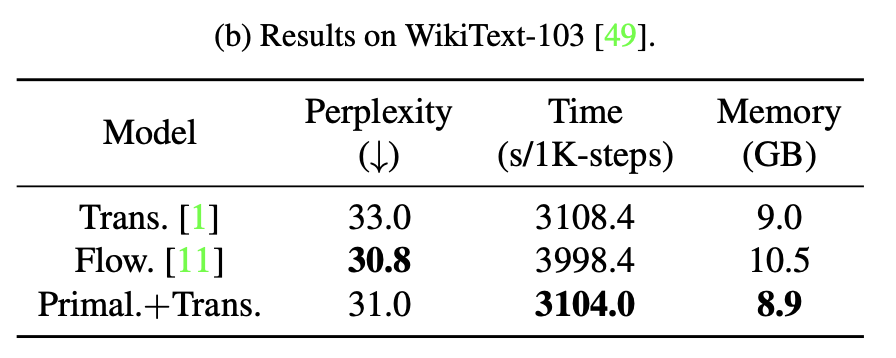

# Primal-Attention for Language Modelling

We consider the language modelling task on [[WikiText-103]](https://paperswithcode.com/sota/language-modelling-on-wikitext-103) with our Primal.+Trans. 

We base our code on the official code of [[fairseq]](https://github.com/facebookresearch/fairseq).

<p align="center">

</p>

## Requirements and installation

Please check [[fairseq](https://github.com/facebookresearch/fairseq)] for installation.

You can also use the following commands for installation:
```bash
# fairest
conda create --name fairseq python=3.8
conda activate fairseq
conda install pytorch==1.11.0 torchvision==0.12.0 torchaudio==0.11.0 cudatoolkit=11.3 -c pytorch
pip install timm==0.4.12 scikit-learn
```

If you encounter cython issues, you may need to run `python setup.py build_ext --inplace` (from [here](https://github.com/facebookresearch/fairseq/issues/2106#issuecomment-1333751526)).

## Get Started

You can check [[fairseq language model](https://github.com/yingyichen-cyy/PrimalAttention/blob/481406f4d8cdacf8d12496eee5a1a4981d9e19ac/PrimalAttention_NLP/examples/language_model/README.md)] for how to download WikiText-103 dataset and how to train a language model.

## Main structure

Please train our model with the following commands:
```bash
python fairseq_cli/train.py --task language_modeling data-bin/wikitext-103 \
  --save-dir checkpoints/primal_eta01_rank30_wikitext-103 --arch transformer_lm \
  --share-decoder-input-output-embed --dropout 0.1 --optimizer adam \
  --adam-betas '(0.9, 0.98)' --weight-decay 0.01 --clip-norm 0.0 --lr 0.001 \
  --lr-scheduler inverse_sqrt --warmup-updates 6000 --warmup-init-lr 1e-07 \
  --tokens-per-sample 512 --sample-break-mode none --max-tokens 2048 \
  --update-freq 16 --max-update 150000
```

We would like to provide a clear path for better understanding of the code and further modification for the readers:

1. It will first open [[fairseq_cli/train](https://github.com/yingyichen-cyy/PrimalAttention/blob/master/PrimalAttention_NLP/fairseq_cli/train.py)], the model building is in [[line 96](https://github.com/yingyichen-cyy/PrimalAttention/blob/481406f4d8cdacf8d12496eee5a1a4981d9e19ac/PrimalAttention_NLP/fairseq_cli/train.py#L96)].
2. Then we actually use [[./fairseq/models/transformer/transformer_decoder.py](https://github.com/yingyichen-cyy/PrimalAttention/blob/481406f4d8cdacf8d12496eee5a1a4981d9e19ac/PrimalAttention_NLP/fairseq/models/transformer/transformer_decoder.py#L445)] to build our 6-layer decoder (no encoder actually). We add one extra input to decide whether use th primal attention or the canonical one [[line 470](https://github.com/yingyichen-cyy/PrimalAttention/blob/481406f4d8cdacf8d12496eee5a1a4981d9e19ac/PrimalAttention_NLP/fairseq/models/transformer/transformer_decoder.py#L470)].
3. The exact control of whether to use primal attention or softmax is in [[./fairseq/modules/transformer_layer.py](https://github.com/yingyichen-cyy/PrimalAttention/blob/481406f4d8cdacf8d12496eee5a1a4981d9e19ac/PrimalAttention_NLP/fairseq/modules/transformer_layer.py#L262)] and we add a "if" [[line 272-285](https://github.com/yingyichen-cyy/PrimalAttention/blob/481406f4d8cdacf8d12496eee5a1a4981d9e19ac/PrimalAttention_NLP/fairseq/modules/transformer_layer.py#L272-L285)].
This corresponds to different [[PrimalMultiheadAttention or MultiheadAttention](https://github.com/yingyichen-cyy/PrimalAttention/blob/481406f4d8cdacf8d12496eee5a1a4981d9e19ac/PrimalAttention_NLP/fairseq/modules/transformer_layer.py#L360-L387)].
4. The softmax attention is provided [[./fairseq/modules/multihead_attention.py](https://github.com/yingyichen-cyy/PrimalAttention/blob/481406f4d8cdacf8d12496eee5a1a4981d9e19ac/PrimalAttention_NLP/fairseq/modules/multihead_attention.py)], and our primal is provided [[./fairseq/modules/primal_attention.py](https://github.com/yingyichen-cyy/PrimalAttention/blob/481406f4d8cdacf8d12496eee5a1a4981d9e19ac/PrimalAttention_NLP/fairseq/modules/primal_attention.py)]. Our modification of primal attention is based on the [[flowformer_nlp](https://github.com/thuml/Flowformer/blob/main/Flowformer_NLP/flow_attention.py)], [[flowformer_rl](https://github.com/thuml/Flowformer/blob/main/Flowformer_RL/decision_transformer/models/flowformer_attention.py)] and our [[primal_rl](https://github.com/yingyichen-cyy/PrimalAttention/blob/master/PrimalAttention_RL/decision_transformer/models/primal_attention.py)].
5. Please remember to add our primal-attention to [[fairseq/modules/__init__.py](https://github.com/yingyichen-cyy/PrimalAttention/blob/481406f4d8cdacf8d12496eee5a1a4981d9e19ac/PrimalAttention_NLP/fairseq/modules/__init__.py#L33-L34)]
6. We output all the necessary parameters for primal attention in [[line 264](https://github.com/yingyichen-cyy/PrimalAttention/blob/481406f4d8cdacf8d12496eee5a1a4981d9e19ac/PrimalAttention_NLP/fairseq/modules/primal_attention.py#L264)], which is sent to [[/fairseq/models/transformer/transformer_decoder.py](https://github.com/yingyichen-cyy/PrimalAttention/blob/481406f4d8cdacf8d12496eee5a1a4981d9e19ac/PrimalAttention_NLP/fairseq/models/transformer/transformer_decoder.py#L355-L356)] and [[line 367](https://github.com/yingyichen-cyy/PrimalAttention/blob/481406f4d8cdacf8d12496eee5a1a4981d9e19ac/PrimalAttention_NLP/fairseq/models/transformer/transformer_decoder.py#L367)], the further [[in this "extra"](https://github.com/yingyichen-cyy/PrimalAttention/blob/481406f4d8cdacf8d12496eee5a1a4981d9e19ac/PrimalAttention_NLP/fairseq/models/transformer/transformer_decoder.py#L232)].
7. The above mentioned parameters are sent to the loss function [[/fairseq/criterions/cross_entropy.py](https://github.com/yingyichen-cyy/PrimalAttention/blob/481406f4d8cdacf8d12496eee5a1a4981d9e19ac/PrimalAttention_NLP/fairseq/criterions/cross_entropy.py#L49-L73)] where we set eta=0.1.

## Efficiency test
Please use the following command to run the efficiency test for one epoch. 
It should be a 5-layer decoder + 1-layer Primal-Attention decoder layer (6 in total). We have added one new file [[fairseq_cli/train_efficiency.py](https://github.com/yingyichen-cyy/PrimalAttention/blob/481406f4d8cdacf8d12496eee5a1a4981d9e19ac/PrimalAttention_NLP/fairseq_cli/train_efficiency.py)]. 
Please manually kill the program after collecting time and memory for one epoch.
```bash
python fairseq_cli/train_efficiency.py --task language_modeling data-bin/wikitext-103 \
  --save-dir checkpoints/primal_eta01_rank30_wikitext-103 --arch transformer_lm \
  --share-decoder-input-output-embed --dropout 0.1 --optimizer adam \
  --adam-betas '(0.9, 0.98)' --weight-decay 0.01 --clip-norm 0.0 --lr 0.001 \
  --lr-scheduler inverse_sqrt --warmup-updates 6000 --warmup-init-lr 1e-07 \
  --tokens-per-sample 512 --sample-break-mode none --max-tokens 2048 \
  --update-freq 16 --max-update 150000
```