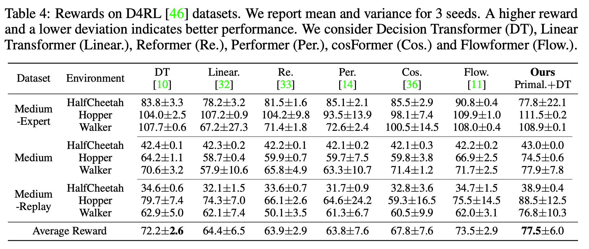

# Primal-Attention for Offline RL

We consider the offline reinforcement learning (RL) performance of our Primal.+Decision Transformer (Primal.+DT) on [[D4RL]](https://github.com/Farama-Foundation/D4RL) benchmark designed for continuous control tasks. 

We base our code on the official code of [[Flowformer]](https://github.com/thuml/Flowformer/tree/main/Flowformer_RL).

<p align="center">

</p>

## Environment Setup
Please follow the commands for environment setup. For more information, please refer to [[MuJoCo version 2.0]](https://www.roboti.us/download.html) and [[D4RL]](https://github.com/Farama-Foundation/D4RL).

First, create a new environment named mujoco:
``` Bash
conda create --name mujoco python=3.8
conda activate mujoco
``` 
Then, install `gym` and further `mujoco`:
``` Bash
pip install gym[mujoco]
pip install git+https://github.com/Farama-Foundation/d4rl@master#egg=d4rl
mkdir ~/.mujoco
cd ~/.mujoco
wget https://mujoco.org/download/mujoco210-linux-x86_64.tar.gz
# unzip it in ~/.mujoco 
tar -xvf mujoco210-linux-x86_64.tar.gz 
# please set to your own path
export LD_LIBRARY_PATH=$LD_LIBRARY_PATH:/users/sista/cheny/.mujoco/mujoco210/bin
export LD_LIBRARY_PATH=$LD_LIBRARY_PATH:/usr/lib/nvidia
conda install -c conda-forge glew
conda install -c conda-forge mesalib
conda install -c menpo glfw3
# need to do this every time after conda activate
export CPATH=$CONDA_PREFIX/include 
``` 
We install the other necessary packages:
``` Bash
pip install patchelf
pip install torch==1.8.1
pip install six
pip install coolname
pip install transformers==4.5.1
``` 
Next, we should use vim to add a few lines:
``` Bash
# please set to your own path
vi /users/sista/cheny/anaconda3/envs/mujoco/lib/python3.8/site-packages/transformers/dependency_versions_check.py
# add pkgs_to_check_at_runtime = "" after line 26
``` 
Last, we install the following packages:
``` Bash
pip install tensorboard==2.7.0
pip install protobuf==3.17.3
```
This completes the environment setup.

## Data preprocessing
Download and preprocess datasets with the following commands:
``` Bash
conda activate mujoco
export CPATH=$CONDA_PREFIX/include

bash ./bashes/preprocess_data.sh
``` 

## Training and evaluation
Train and evaluate our model with the following commands:
``` Bash
conda activate mujoco
export CPATH=$CONDA_PREFIX/include

bash ./bashes/run_primal_dt.sh
``` 

## Acknowledgement

We appreciate the following github repositories a lot for their valuable code base:

https://github.com/thuml/Flowformer/tree/main/Flowformer_RL

https://github.com/kzl/decision-transformer
