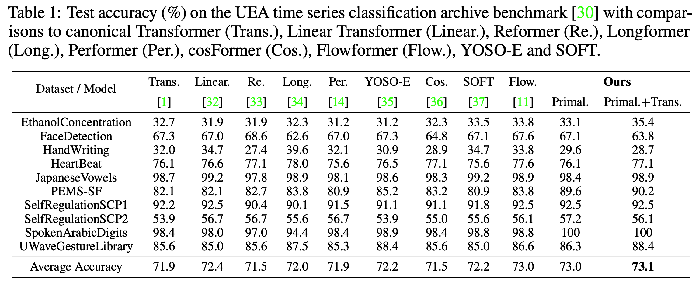

# PrimalFormer for Time Series Classification

In PrimalFormer, Primal-Attention is applied to all attention layers, regularized with the KSVD loss. Note that we adopt the data-dependent projetcion weights for Primal-Attention where the projections are based on a subset of $X$ by uniformly sampling $n=\min${ $s$*10, $N$ } points from $X$ for efficiency aspects.

We test our PrimalFormer on the [[UEA Time Series Classification Archive]](https://www.timeseriesclassification.com/), which is the benchmark for the evaluation on temporal sequences.
We include 10 multivariate subsets which can be downloaded from [[aeon formatted ts files]](https://www.timeseriesclassification.com/ClassificationDownloads/Archives/Multivariate2018_ts.zip):

<p align="center">

</p>

## Get Started

1. Install the packages by the following commands.

```shell
pip install -r requirements.txt
```

2. Download the dataset from [[aeon formatted ts files]](https://www.timeseriesclassification.com/ClassificationDownloads/Archives/Multivariate2018_ts.zip).

3. Train and evaluate the model with following commands. We use the "Best accuracy" as our metric for all baselines and experiments.

```shell
bash ./bashes/run_primalformer.sh
```

## Acknowledgement

We appreciate the following github repositories for their valuable codes:

https://github.com/gzerveas/mvts_transformer

https://github.com/thuml/Autoformer

https://github.com/thuml/Flowformer/tree/main/Flowformer_TimeSeries
