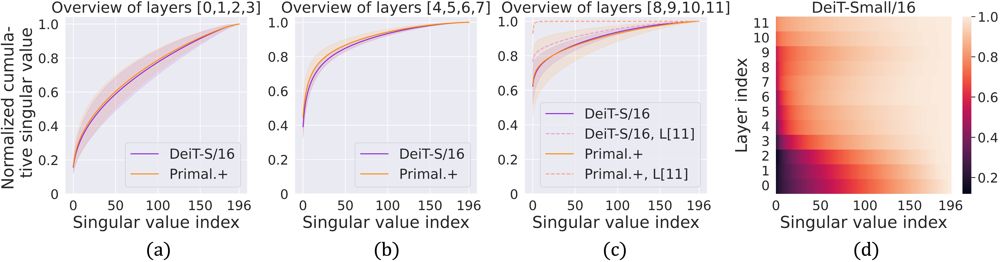

# PrimalAttention
(NeurIPS 2023) PyTorch implementation of **Primal-Attention** available on https://arxiv.org/abs/2305.19798.

**Primal-Attention: Self-attention through Asymmetric Kernel SVD in Primal Representation**

by *[Yingyi Chen*](https://yingyichen-cyy.github.io/),
[Qinghua Tao*](https://qinghua-tao.github.io/), 
[Francesco Tonin](https://taralloc.github.io/), 
[Johan A.K. Suykens](https://www.esat.kuleuven.be/sista/members/suykens.html)*

[[arXiv](https://arxiv.org/abs/2305.19798)]
[[PDF](https://openreview.net/forum?id=bRyduWAAVT)]
[[Video](https://nips.cc/virtual/2023/poster/71144)]
[[Poster](https://yingyichen-cyy.github.io/Primal-Attention/resrc/poster.pdf)]
[[Project Page](https://yingyichen-cyy.github.io/Primal-Attention/)]

<p align="center">

<br><br>
<b>Figure 1.</b> An illustration of Primal-Attention and canonical self-attention.
</p>

If our project is helpful for your research, please consider citing:
``` 
@article{chen2023primal,
  title={Primal-Attention: Self-attention through Asymmetric Kernel SVD in Primal Representation},
  author={Chen, Yingyi and Tao, Qinghua and Tonin, Francesco and Suykens, Johan A.K.},
  journal={Advances in Neural Information Processing Systems},
  year={2023}
}
```

## Table of Content
Please refer to different folders for detailed experiment instructions. 
Note that we specified **different environments for different tasks**, among which the environment for reinforcement learning is the most complicated.

Please feel free to contact yingyi.chen@esat.kuleuven.be for any discussion.

* [1. Time Series Classification (UEA)](https://github.com/yingyichen-cyy/PrimalAttention/tree/master/PrimalAttention_TimeSeries)
  - [PrimalFormer](https://github.com/yingyichen-cyy/PrimalAttention/tree/master/PrimalAttention_TimeSeries/PrimalFormer)
  - [Primal.+Transformer](https://github.com/yingyichen-cyy/PrimalAttention/tree/master/PrimalAttention_TimeSeries/Primal.%2BTrans.)
* [2. Long Sequence Modeling (LRA)](https://github.com/yingyichen-cyy/PrimalAttention/tree/master/PrimalAttention_LRA)
  - [PrimalFormer](https://github.com/yingyichen-cyy/PrimalAttention/tree/master/PrimalAttention_LRA/PrimalFormer)
  - [Primal.+Transformer](https://github.com/yingyichen-cyy/PrimalAttention/tree/master/PrimalAttention_LRA/Primal.%2BTrans.)
* [3. Reinforcement Learning (D4RL)](https://github.com/yingyichen-cyy/PrimalAttention/tree/master/PrimalAttention_RL)
* [4. Vision Recognization (ImageNet-100, ImageNet-1K)](https://github.com/yingyichen-cyy/PrimalAttention/tree/master/PrimalAttention_CV)
* [5. Language Modelling (WikiText-103)](https://github.com/yingyichen-cyy/PrimalAttention/tree/master/PrimalAttention_NLP)

## Spectrum Analysis
<p align="center">

<br><br>
<b>Figure 2.</b> Spectrum analysis of the canonical self-attention matrix and Primal-Attention matrix on ImageNet-1K.
</p>

## Acknowledgement
This repository is based on the official codes of 
**Time Series**:
[Flowformer](https://github.com/thuml/Flowformer/tree/main/Flowformer_TimeSeries), 
[mvts_transformer](https://github.com/gzerveas/mvts_transformer),
[Autoformer](https://github.com/thuml/Autoformer),
**LRA**:
[LRA](https://github.com/google-research/long-range-arena),
[Nystromformer](https://github.com/mlpen/Nystromformer/tree/main),
**RL**:
[Decision Transformer](https://github.com/kzl/decision-transformer),
[Flowformer](https://github.com/thuml/Flowformer/tree/main/Flowformer_TimeSeries), 
and
**CV**:
[DeiT](https://github.com/facebookresearch/deit/blob/main/README_deit.md).
**NLP**:
[fairseq](https://github.com/facebookresearch/fairseq).